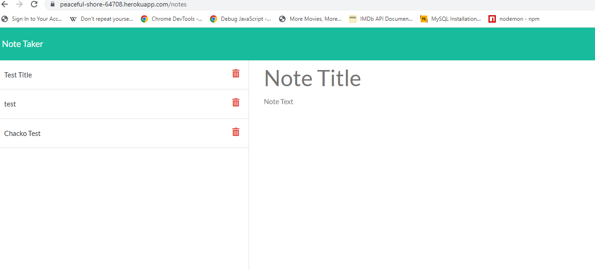

# Note Taker Berkeley Bootcamp Challenge

## Designed for users to organize their notes and thoughts! Made with simplicity in mind

## Technologies Used
* Back End: Node.js, express, and heroku for deployment
* Front End: HTML, Javascript

## To install on your local computer
- clone the repository, nun on npm i to install dependencies, then npm start to start the server! Go to localhost:3001 to use!

## Link to live deployment
Heroku Link: https://peaceful-shore-64708.herokuapp.com/

## Screenshot below!

